+++
author = "Rémi Lacombe"
title = "TP1"
date = "2019-03-09"
description = "Sections achat et vente"
+++

## 0. Introduction

<!-- À modifier -->
Ce matin, au réveil, une idée **incroyable** m'est venue : je vais tout plaquer et vendre des **canards en plastique** sur Internet !  
Bien sûr... pour passer de l'idée à la réalité, il me faut un bon outil de gestion.  
J'ai choisi Odoo car c'est open-source et facile d'utilisation !  
L'objectif de cette première partie est d'établir un processus d'achat-vente. **C'est parti !**

## 1. Création des données de base

### 1.1. Créer un entrepôt et un emplacement

Pour vendre mes canards, j'ai acheté un **entrepôt**, je dois maintenant l'ajouter à mon nouvel **ERP** !

Après m'être rendu sur le panneau **inventaire**, on crée un entrepôt :  
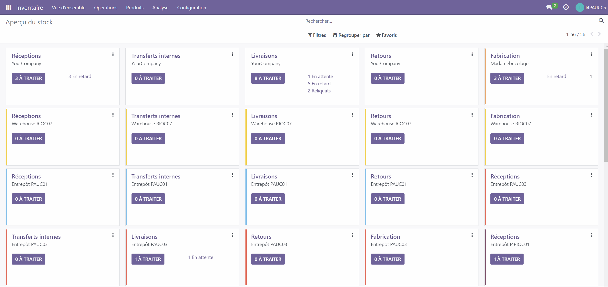

Pour m'y retrouver un peu mieux au milieu de tous ces canards, je crée un emplacement "Allée A" :  
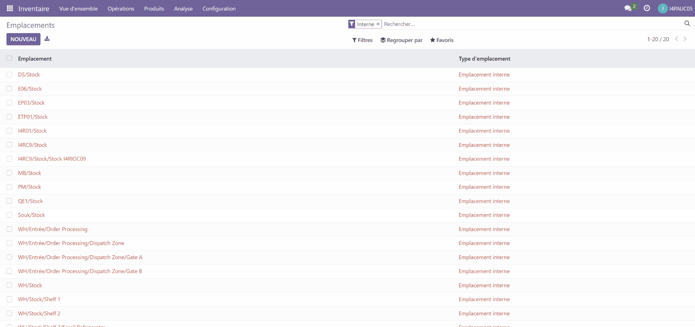

### 1.2. Créer deux clients

Il faut maintenant créer des clients qui achèteront nos canards en plastique !

Pour cela, rendez-vous dans le panneau **vente** :  
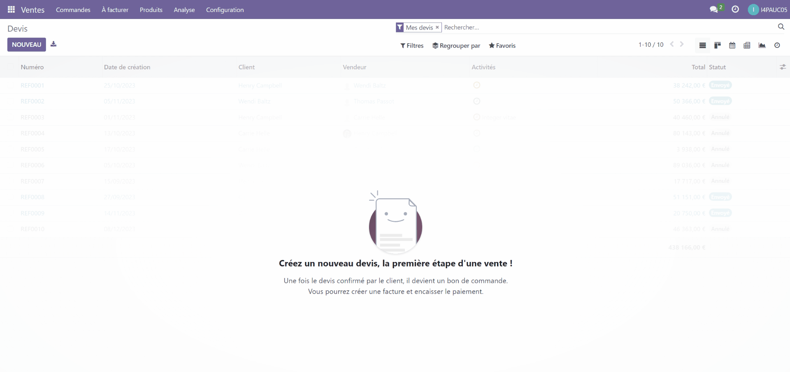

On fera de même pour mon second plus gros client, **Monsters Inc** :
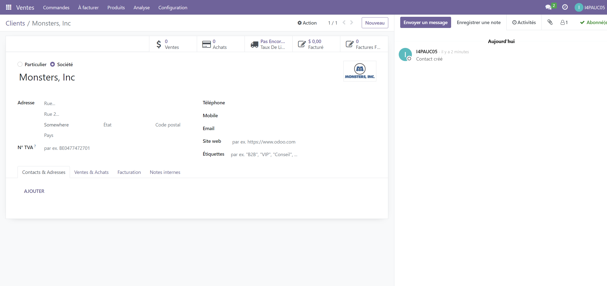

### 1.3. Créer un fournisseur

Pour vendre mes canards, je dois d'abord les acheter chez un fabricant.  
L'entreprise DuckMaker offre une gamme diversifiée de canards en tous genres, ça sera parfait !  
On renseigne le fournisseur dans le panneau **Achats** :
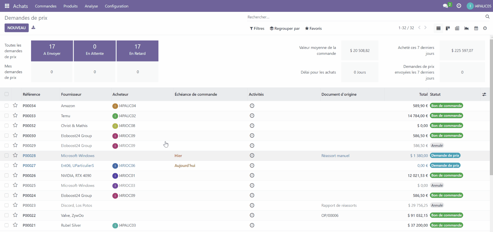

### 1.4. Créer un produit

On peut finalement créer notre premier produit !  
Après une rapide étude de marché (et parce que c'est classe), mon premier produit sera un **canard robot** !
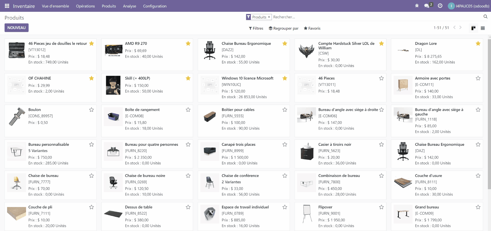

## 2. Processus d'achat-vente

### 2.1. Création de devis

Maintenant que ma boutique est en ligne, mes premières commandes me sont parvenues.  
Je dois maintenant créer des devis, d'abord pour Stark Industries :
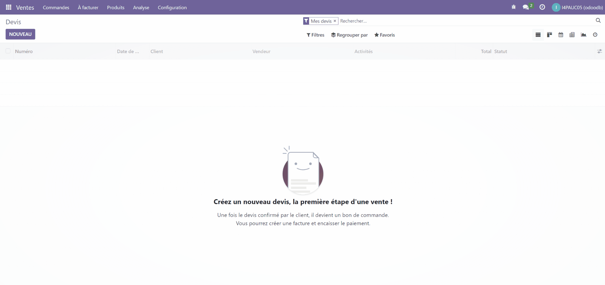

Puis pour Monster, Inc :
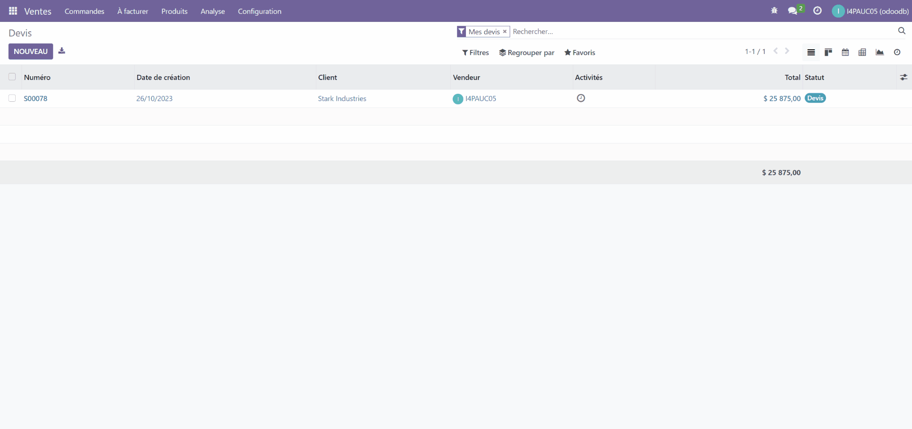

Pour transmettre ces devis aux clients, je peux les imprimer ou les exporter :


Si ce devis est validé par le client, je peux en faire un bon de commande :
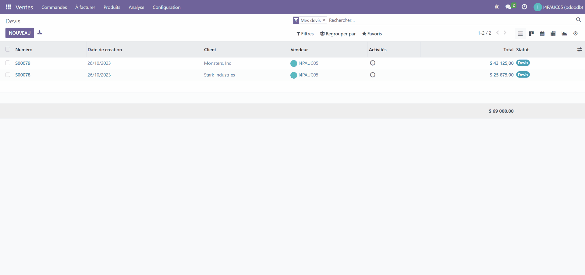

Une nouvelle ligne apparaît dans le tableau de commande avec la mention "à facturer" :
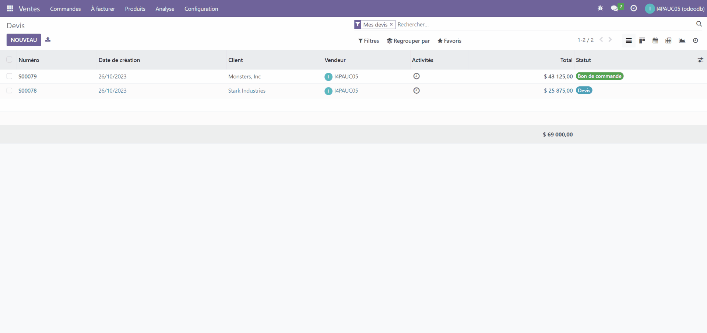

On voit la mention "entièrement facturé" apparaître dans le tableau des commandes :
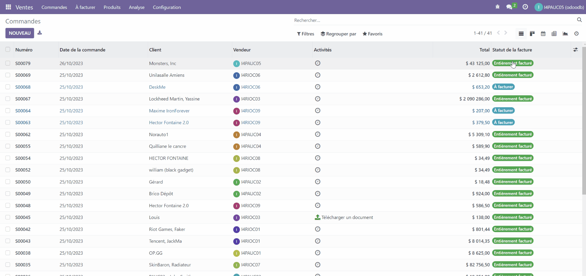

### 2.2. Créer une demande de prix et définir l’emplacement de la réception de la livraison fournisseur

Voilà que je suis bientôt à court de canards ! Je vais donc déposer une demande de prix chez mon fournisseur, je définis l'adresse de livraison à l'entrepôt DuckShop créé plus tôt :
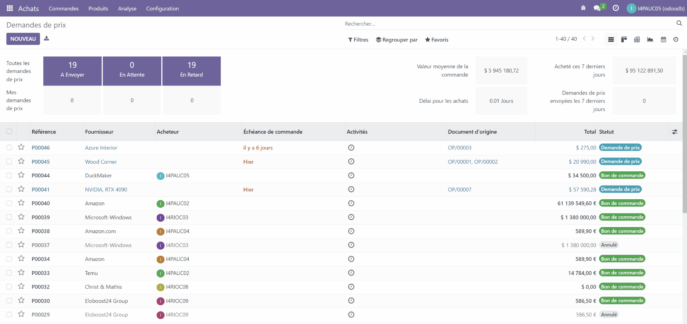

Réponse positive de DuckMaker ! Je peux confirmer la commande :
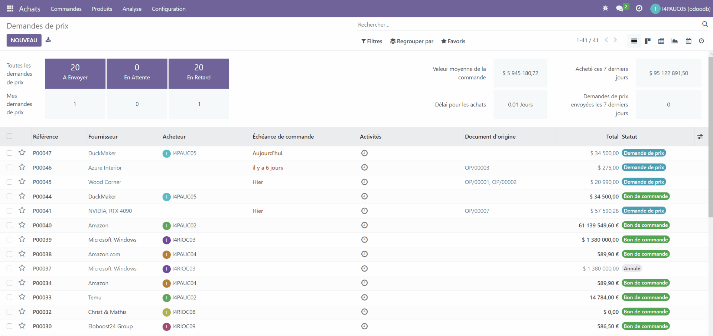

On constate que le bon de commande est disponible :


### 2.3. Effectuer la réception

Ça y est ! Le colis est arrivé ! Je saisis la réception :

On va maintenant consulter les stocks dans les réceptions de l'entrepôt DuckShop :
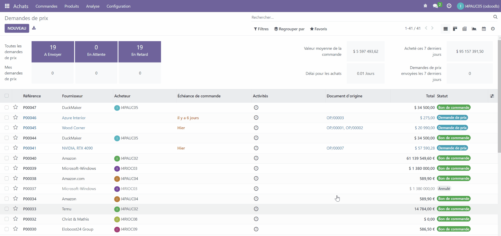

### 2.4. Effectuer un transfert de stock

Je souhaite maintenant déplacer les canards livrés de l'emplacement "Stock" à l'Allée A :
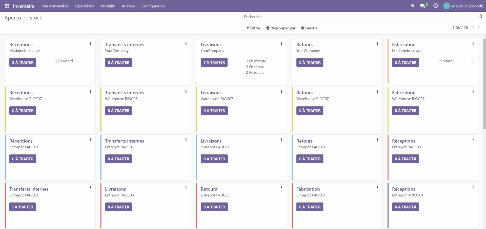

Fioouuu... Je viens de déplacer les 8 palettes ! Je peux maintenant valider le transfert :
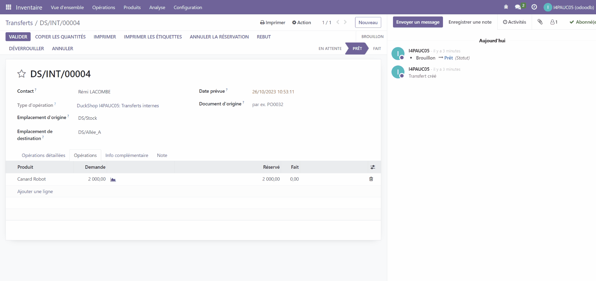

### 2.5. Effectuer les livraisons clients - Factures

Je peux enfin répondre aux commandes de mes clients ! J'édite pour cela une facture.  
Pour Stark Industries, par exemple :
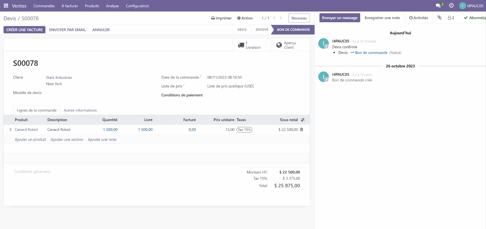

Le client est satisfait, on peut à présent valider la facture et déclarer le paiement :
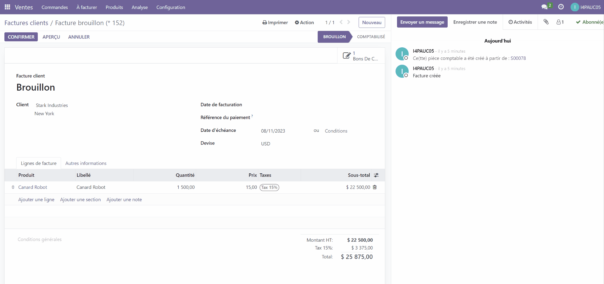

### 2.6. Effectuer les livraisons clients - Livraison Client

On procède finalement à la livraison :
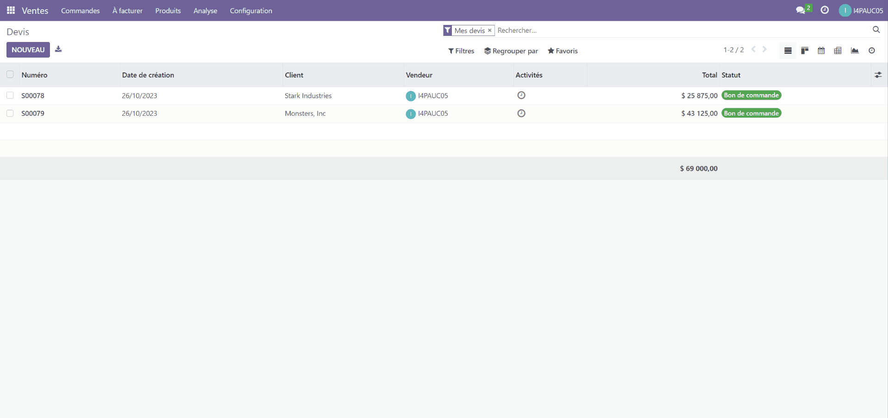

### 2.7. Vérifier la mise à jour du stock

Puis on vérifie l'état des stocks :
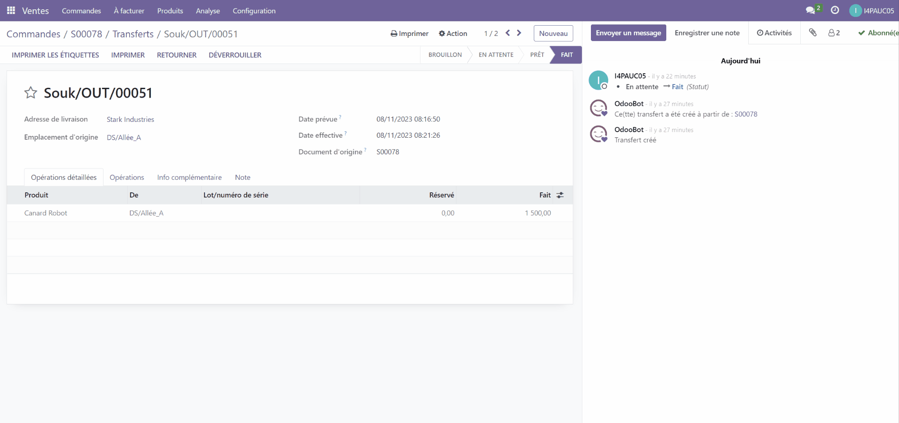

## 3. Conclusion

Pour résumer, dans ce TP nous avons :

>- Modifié les réglages de notre ERP afin d'y ajouter tous les acteurs et emplacements nécessaires à une transaction, du **fournisseur**, en passant par notre **entrepôt**, jusqu'aux **clients**.
>- Édité des documents comme des **devis** et **factures** de manière automatique.
>- Effectué des **commandes**, **transferts de stock** et **livraisons**.

**Durant le prochain TP, nous verrons comment étendre nos compétences en passant à la fabrication !**
