+++
author = "Rémi Lacombe"
title = "TP2"
date = "2019-03-09"
description = "Sections fabrication et inventaire"
+++

Sections fabrication et inventaire.
<!--more-->

## 1. Introduction

Cela fait quelques mois que mon commerce fonctionne, j'ai vendu des milliers de canards et le temps devient un peu long. Il est temps de commencer un nouveau projet : **l'internalisation de la fabrication de canards en plastique !**  
**C'est parti !**

L'un de mes gros clients a une forte demande en canards de couleur verte, ce sera donc le premier produit que je fabriquerai !  
J'établis pour cela une nomenclature des opérations :  



## 2. Activité demandée

### 2.1. Création des postes de charges

Comme montré plus haut, j'ai identifié deux postes de charge. Je dois maintenant les créer dans mon ERP :

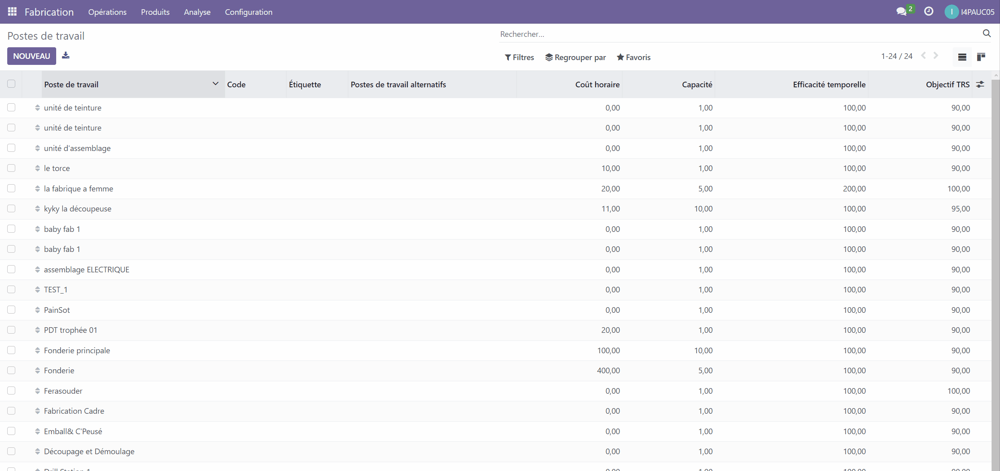

On fait de même pour le poste de peinture.

### 2.2. Création des gammes

On créera les opérations dans la partie 2.4.

### 2.3. Création des articles

Je crée les matières premières (A1, A2, A3 et A4), le sous-produit en sortie de moulage (SP1) ainsi que le produit fini (PF).

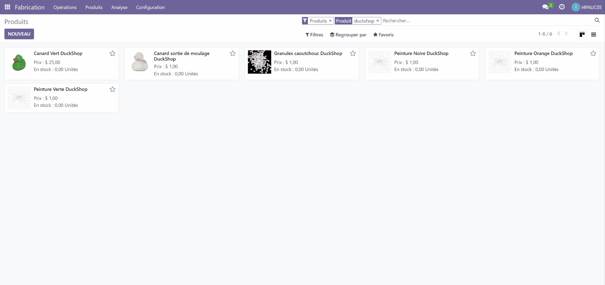

### 2.4. Création des nomenclatures

Les produits créés, il faut à présent indiquer les nomenclatures :
On commence par la nomenclature du produit **"Canard sortie de moulage"**.  
On indique qu'il faut 0.2 unités de granule de caoutchouc. On spécifie également l'opération **"Moulage"** en précisant le poste de charge **"Station de moulage"**

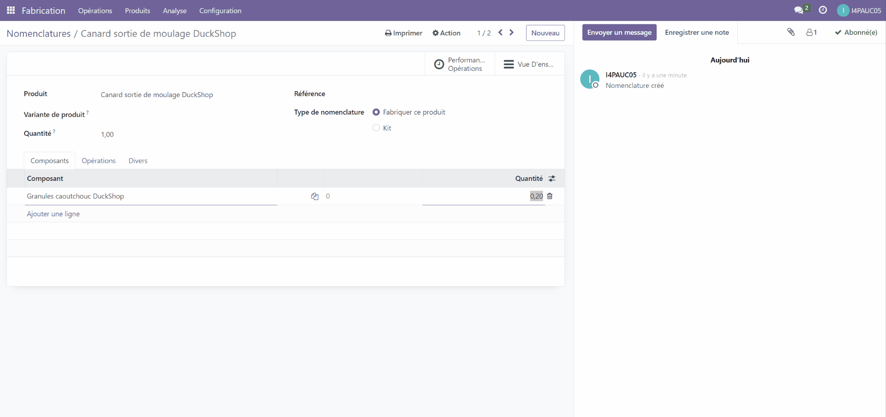

De même pour le produit fini **"Canard Vert"**. On saisit la nomenclature en ajoutant le produit **"Canard sortie de moulage"** ainsi que tous les types de peinture et leurs quantités respectives. On crée une opération **"Peinture"** dans le poste de charge **"Station de peinture"**

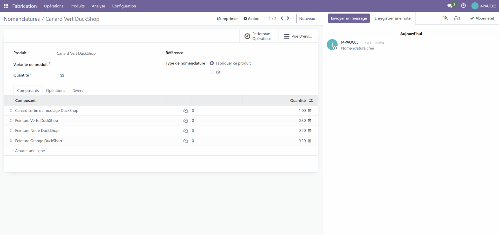

### 2.5. Rapports Structure nomenclature et coût

J'effectue quelques modifications dans les capacités et coûts des postes de travail pour avoir des résultats plus cohérents.  
Un exemple de changement effectué est la fabrication de plusieurs canards en même temps, cela permet de n'avoir qu'un seul temps de réglage et de nettoyage pour un lot. On fera ici des lots de 50.
Après modification, voici le rapport de nomenclature du produit **"Canard Vert"**.



### 2.6. Faire deux commandes clients avec des variantes couleurs différentes

Un client me réclame des canards rouges !
On renomme le produit **"Canard Vert"** en **"Canard Uni"** et on y ajoute deux variantes.

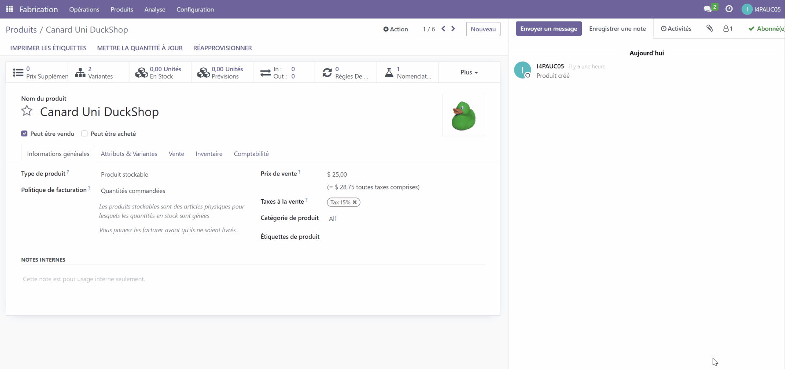

On crée un nouveau produit pour la peinture rouge. Il faut également ajouter une nomenclature pour la variante rouge. Voici les 3 nomenclatures ainsi créées.

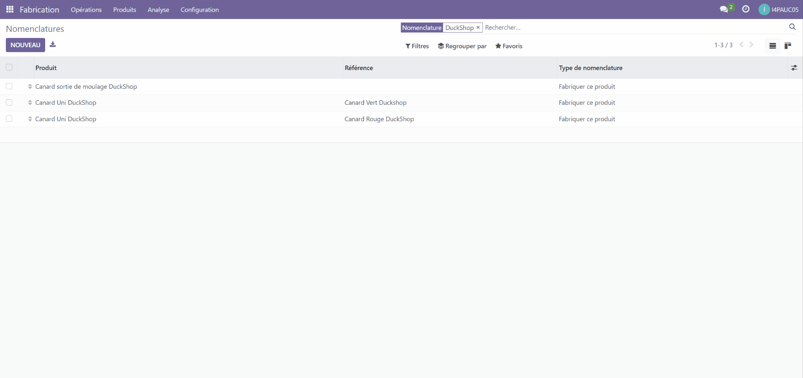

Une fois que cela est fait, on peut enfin rentrer les commandes :

Stark Industries commandent 50 canards verts :

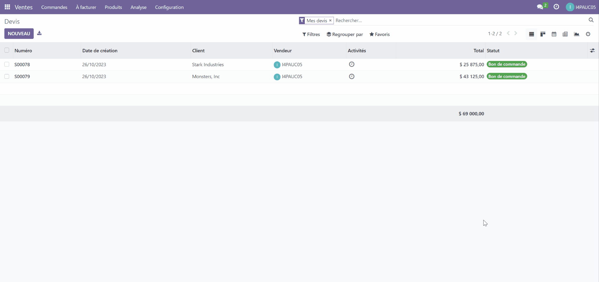

Et Monster .inc commandent 100 canards rouges :

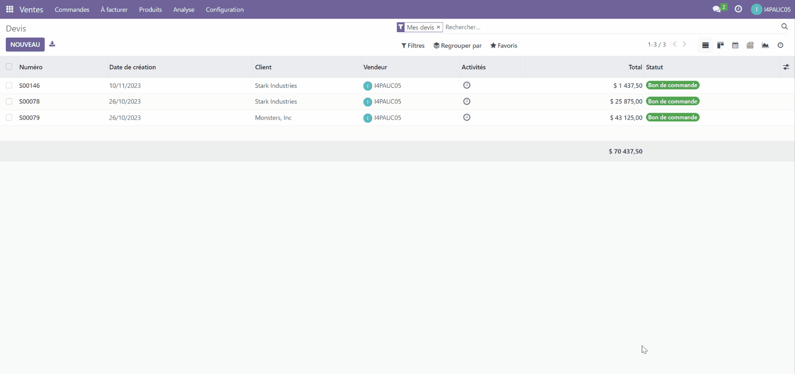

### 2.7. Lancer un ordre de fabrication

On va se concentrer ici sur la commande de Stark Industries : **50 canards verts**
Je crée, avant tout l'ordre de fabrication :

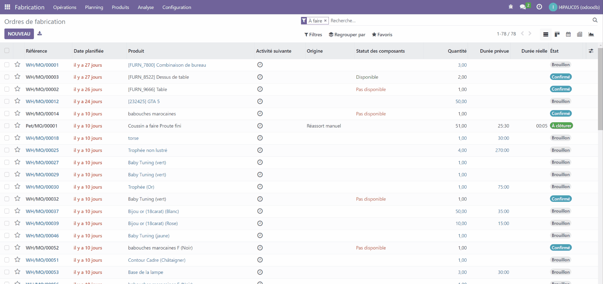

On s'aperçoit que l'ensemble des matières premières et sous-produits apparaissent en **"Non disponible"**
Je vais donc commander les matériaux nécessaires. Par souci de facilité, j'en commande 200 de chaque, en suivant la démarche vue en TP1.

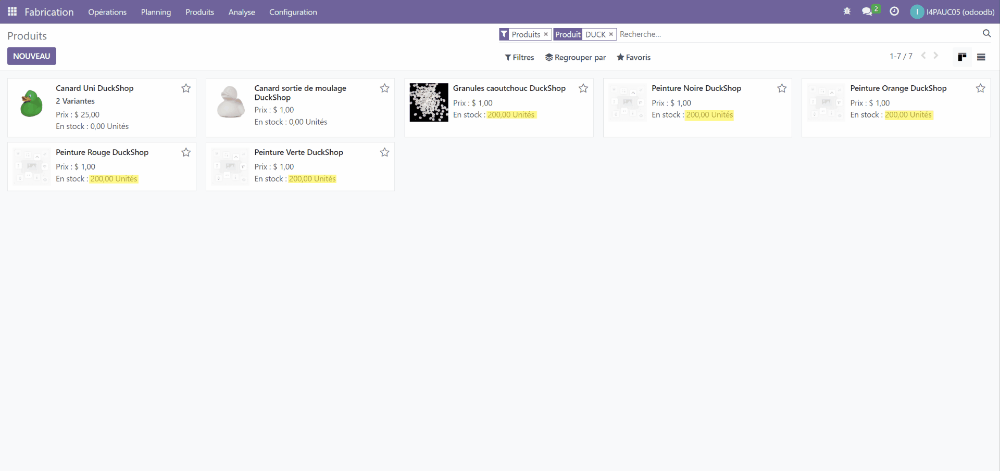

Si je retourne sur mon ordre de fabrication initial, je vois qu'il manque encore le sous-produit **"Canard sortie de moulage"**, je vais donc lancer un autre ordre de fabrication pour en produire 50.

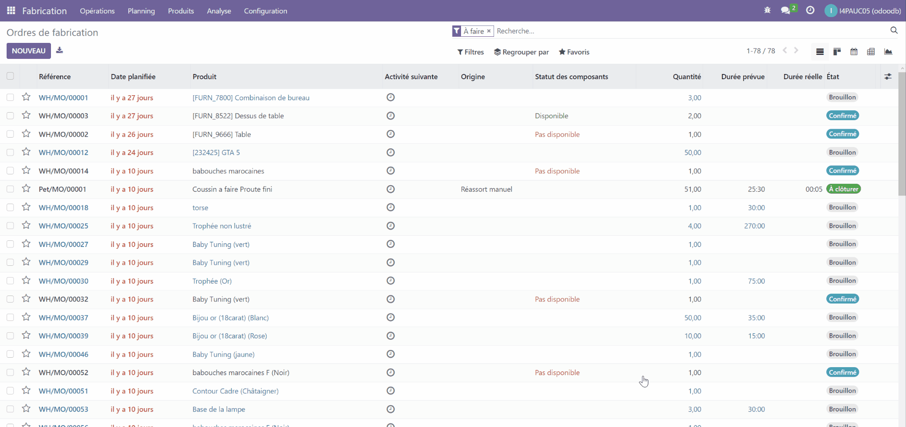

### 2.8. Créer des ordres de travail

On peut enfin lancer la fabrication du sous-produit :

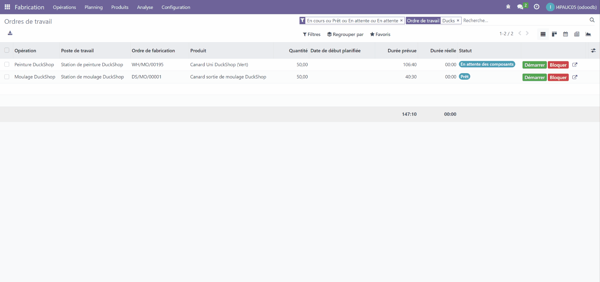

Avant de lancer les ordres sur le produit fini, on valide l'ordre de fabrication du sous-produit :

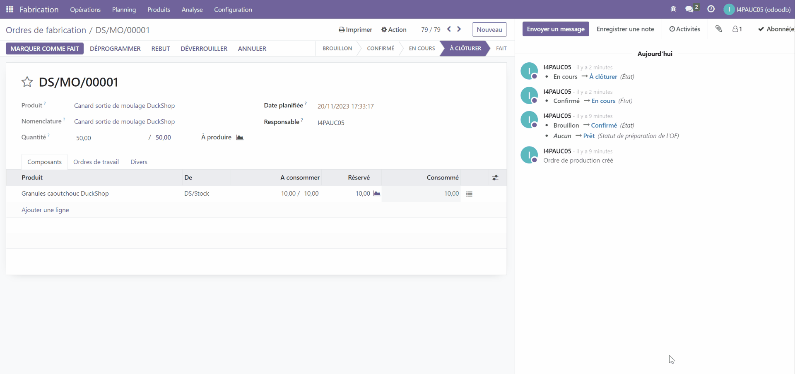

Finalement, on lance la fabrication des canards verts !

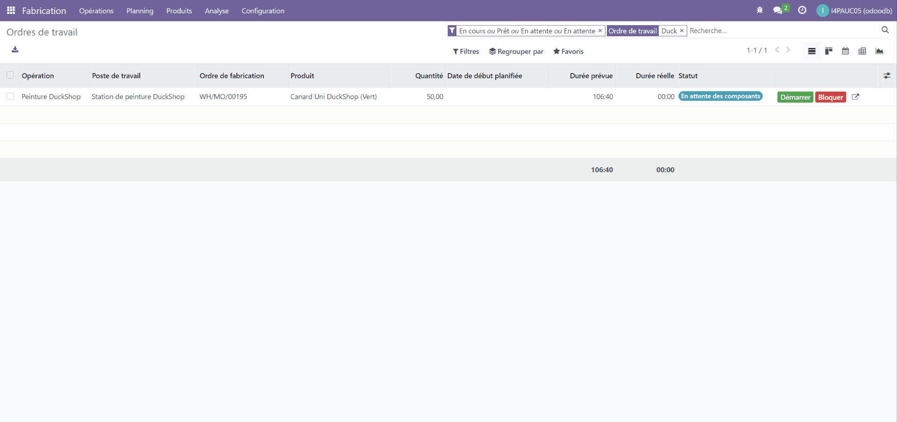

On valide l'ordre de fabrication comme précédemment, et on constate que notre stock a bel et bien été incrémenté de 50 canards verts !

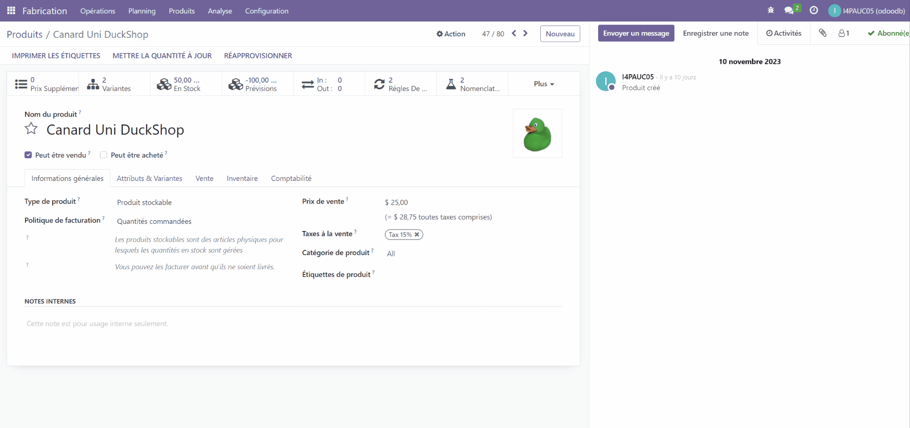

### 2.9 Livrer la commande client

**Fiooouu, quelle aventure !** On peut enfin livrer la commande au client :

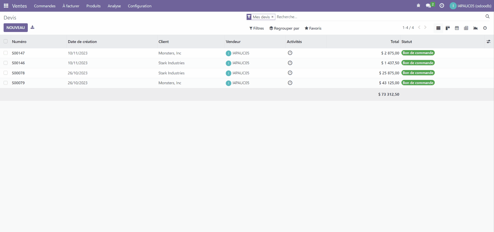

## 2. Conclusion

Pour conclure, dans ce deuxième TP, j'ai appris :

>- Créer des **postes de travail** et d'**opération** (ou **gammes**)
>- Créer des **nomenclatures de production** et les **sous-produits** et **matières premières** associés
>- Créer des **variantes de produits** et les **nomenclatures** modifiées
>- Utiliser et mettre en place les **ordres de fabrication et de travail**

Durant ces deux TP, j'ai pu aborder et mettre en place la plupart des postes de la **supply chain**.  
À travers la création de cette fausse entreprise, je me suis amusé, je dois l'avouer 😁, mais j'ai surtout découvert un outil puissant et polyvalent qui, je n'en doute pas, me permettra d'appréhender un peu mieux la gestion de production dans mon futur métier !
